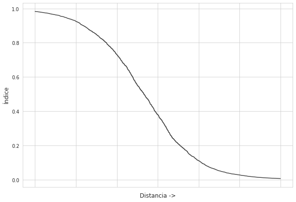
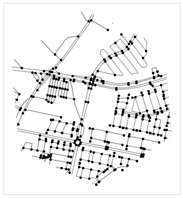
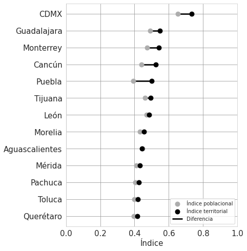
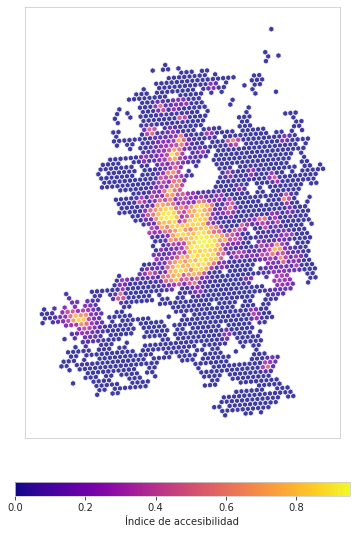
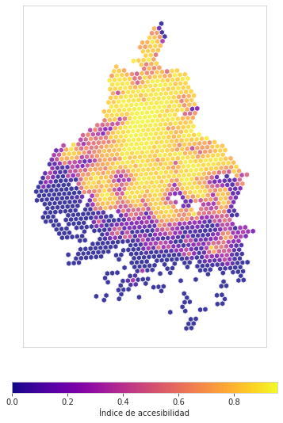

Last-update: 22/11/21

# Índice de proximidad

## Proximidad
Con el objetivo de analizar la accesibilidad urbana durante la pandemia por COVID-19 hemos creado un índice basado en la distancia a distintos servicios y equipamientos. Dado el contexto, optamos por analizar la distancia a farmacias, supermercados y hospitales, ya que consideramos que son sitios vitales para el abasto, acceso a medicina y atención médica. Para calcular las distancias utilizamos la morfología urbana, considerada a partir de los nodos y aristas viales, que se obtuvieron utilizando [OSMnx](https://osmnx.readthedocs.io/en/stable/). Cada establecimiento fue analizado de forma individual con parámetros de distancia específicos:
+ Farmacias: hasta 300m se considera un acceso óptimo y más allá de 1000m inadecuado.
+ Supermercados: hasta 300m se considera un acceso óptimo y más allá de 1000m inadecuado.
+ Hospitales: hasta 1000m se considera un acceso óptimo y más allá de 5000m inadecuado.

## Creando el índice
Tomando en cuenta los parámetros de distancia le aplicamos una función a cada uno que cambia la distancia a un valor entre 0 y 1. Por las características de los datos y los parámetros optamos por utilizar una función sigmoidal, que fue adaptada para cada servicio y equipamiento.

## Índice de proximidad: Población vs Territorio
El índice fue dividido en dos: territorio y población. Ambos se obtienen con la distancia a los servicios y equipamientos y utilizando la función sigmoidal de la sección anterior, además de que se representan usando los hexágonos de [H3](https://h3geo.org/). La diferencia se encuentra en que el índice territorial toma en cuenta los nodos que se encuentran en cada hexágono, dando un peso mayor a aquellos hexágonos con un mayor número de nodos.

Por su parte, el índice poblaciónal solo considera aquellos hexágonos que contienen información poblacional. Esta distincción nos permite estudiar todo el territorio y los sitios en los que se concentra la población.

### Querétaro
A continuación, se muestra el resultado del índice de proximidad para Querétaro. Aquellas zonas que no contienen hexágonos representan áreas urbanas que no contienen nodos, lo que quiere decir que no se puede calcular distancia alguna para estos. Ahora, analizando la imagen, podemos observar la distribución de la proximidad e identificar las zonas más consolidadas, las cuales tienden a encontrarse cercanas al centro histórico de las ciudades. Mientras que los nuevos desarrollos en las periferias tienden a tener una calificación más baja para el índice. También podemos observar que hay muchos hexágonos con calificaciones cercanas a cero, esto se debe a que el índice se calcula para todo el municipio, no solo para áreas completamente urbanizadas.

### Ciudad de México
En la Ciudad de México podemos observar una dinámica distinta. Su desarrollo urbano y su ubicación dentro de la Zona Metropolitana del Valle de México hace que tenga una distribución del índice distinta a la de Querétaro, e incluso a la de otras ciudades mexicanas. Podemos notar que hay áreas urbanas consolidadas hacia el centro y norte de la ciudad, mientras que se observan valores más bajos del índice hacia el sur.

